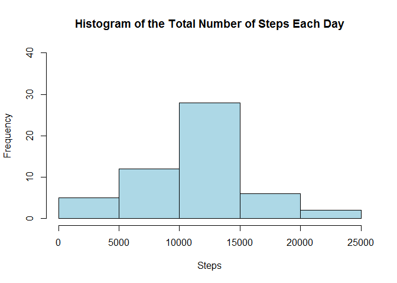
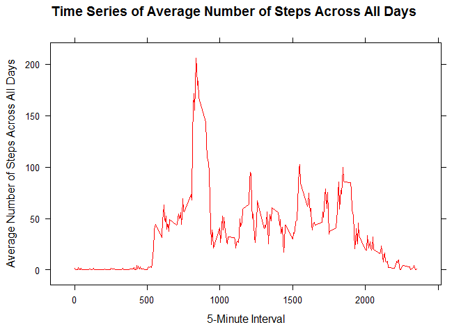
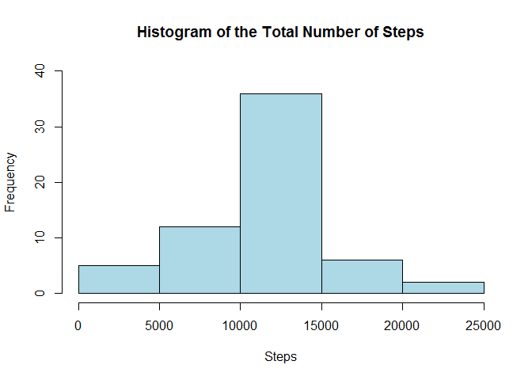
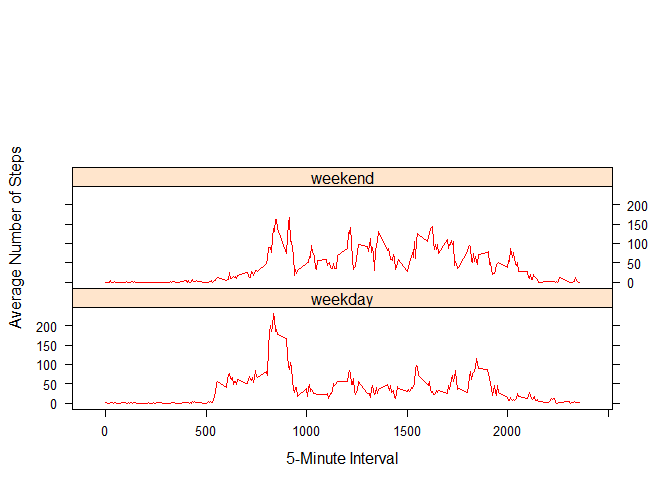

# Reproducible Research: Peer Assessment 1

## Loading and preprocessing activity data

### 1. Load the data


```r
activity <- read.csv(unz("activity.zip", "activity.csv"))
head(activity)
```

```
##   steps       date interval
## 1    NA 2012-10-01        0
## 2    NA 2012-10-01        5
## 3    NA 2012-10-01       10
## 4    NA 2012-10-01       15
## 5    NA 2012-10-01       20
## 6    NA 2012-10-01       25
```

```r
tail(activity)
```

```
##       steps       date interval
## 17563    NA 2012-11-30     2330
## 17564    NA 2012-11-30     2335
## 17565    NA 2012-11-30     2340
## 17566    NA 2012-11-30     2345
## 17567    NA 2012-11-30     2350
## 17568    NA 2012-11-30     2355
```

```r
summary(activity)
```

```
##      steps                date          interval     
##  Min.   :  0.00   2012-10-01:  288   Min.   :   0.0  
##  1st Qu.:  0.00   2012-10-02:  288   1st Qu.: 588.8  
##  Median :  0.00   2012-10-03:  288   Median :1177.5  
##  Mean   : 37.38   2012-10-04:  288   Mean   :1177.5  
##  3rd Qu.: 12.00   2012-10-05:  288   3rd Qu.:1766.2  
##  Max.   :806.00   2012-10-06:  288   Max.   :2355.0  
##  NA's   :2304     (Other)   :15840
```

### 2. Process/transform the data (if necessary) into a format suitable for your analysis

#### No transformation necessary at this point.

## What is mean total number of steps taken per day?

### 1. Make a histogram of the total number of steps taken each day

```r
steps_date <- activity[ , colnames(activity) %in% c('steps','date') ]
steps_dsum <- aggregate(.~date, data=steps_date, sum)
hist(steps_dsum[,2], 
     xlab="Steps",
     ylim=(c(0,40)),
     col='light blue',
     main="Histogram of Total Number of Steps Each Day")
```

 

### 2. Calculate and report the **mean** and **median** total number of steps taken per day

```r
mean(steps_dsum$steps, na.rm=TRUE)
```

```
## [1] 10766.19
```

```r
median(steps_dsum$steps,na.rm=TRUE)
```

```
## [1] 10765
```

## What is the average daily activity pattern?

### 1. Make a time series plot (i.e. `type = "l"`) of the 5-minute interval (x-axis) and the average number of steps taken, averaged across all days (y-axis)

```r
steps_interval <- activity[ , colnames(activity) %in% c('steps','interval') ]
steps_imean <- aggregate(.~interval, data=steps_interval, mean)
head(steps_imean)
```

```
##   interval     steps
## 1        0 1.7169811
## 2        5 0.3396226
## 3       10 0.1320755
## 4       15 0.1509434
## 5       20 0.0754717
## 6       25 2.0943396
```

```r
summary(steps_imean)
```

```
##     interval          steps        
##  Min.   :   0.0   Min.   :  0.000  
##  1st Qu.: 588.8   1st Qu.:  2.486  
##  Median :1177.5   Median : 34.113  
##  Mean   :1177.5   Mean   : 37.383  
##  3rd Qu.:1766.2   3rd Qu.: 52.835  
##  Max.   :2355.0   Max.   :206.170
```

```r
library("lattice")
xyplot(steps ~ interval,
       data = steps_imean,
       type = "l",
       lty = 1,
       lwd = 1,
       main = "Time Series of Average Number of Steps Across All Days",
       xlab = "5-Minute Interval",
       ylab = "Average Number of Steps Across All Days",
       col.line = "red")
```

 

### 2. Which 5-minute interval, on average across all the days in the dataset, contains the maximum number of steps?

```r
steps_imean[steps_imean$steps == max(steps_imean$steps), ]
```

```
##     interval    steps
## 104      835 206.1698
```

## Imputing missing values

### 1. Calculate and report the total number of missing values in the dataset (i.e. the total number of rows with `NA`s)

```r
a <- table(complete.cases(activity))
a[names(a)==FALSE]
```

```
## FALSE 
##  2304
```

### 2.Devise a strategy for filling in all of the missing values in the dataset. The strategy does not need to be sophisticated. For example, you could use the mean/median for that day, or the mean for that 5-minute interval, etc.

#### We decide to fill each missing value with the mean for that 5-minute interval

### 3. Create a new dataset that is equal to the original dataset but with the missing data filled in.

```r
activity_complete <- activity
na.steps <- which(is.na(activity_complete$steps))
na.interval <- activity_complete$interval[na.steps]
activity_complete$steps[na.steps] <- steps_imean$steps[match(na.interval, steps_imean$interval)]
b <- table(complete.cases(activity_complete))
b[names(b)==FALSE]
```

```
## named integer(0)
```

```r
head(steps_imean)
```

```
##   interval     steps
## 1        0 1.7169811
## 2        5 0.3396226
## 3       10 0.1320755
## 4       15 0.1509434
## 5       20 0.0754717
## 6       25 2.0943396
```

```r
head(activity_complete)
```

```
##       steps       date interval
## 1 1.7169811 2012-10-01        0
## 2 0.3396226 2012-10-01        5
## 3 0.1320755 2012-10-01       10
## 4 0.1509434 2012-10-01       15
## 5 0.0754717 2012-10-01       20
## 6 2.0943396 2012-10-01       25
```

```r
tail(steps_imean)
```

```
##     interval     steps
## 283     2330 2.6037736
## 284     2335 4.6981132
## 285     2340 3.3018868
## 286     2345 0.6415094
## 287     2350 0.2264151
## 288     2355 1.0754717
```

```r
tail(activity_complete)
```

```
##           steps       date interval
## 17563 2.6037736 2012-11-30     2330
## 17564 4.6981132 2012-11-30     2335
## 17565 3.3018868 2012-11-30     2340
## 17566 0.6415094 2012-11-30     2345
## 17567 0.2264151 2012-11-30     2350
## 17568 1.0754717 2012-11-30     2355
```

### 4. Make a histogram of the total number of steps taken each day and Calculate and report the **mean** and **median** total number of steps taken per day. Do these values differ from the estimates from the first part of the assignment? What is the impact of imputing missing data on the estimates of the total daily number of steps?

```r
steps_date_complete <- activity_complete[ , colnames(activity_complete) %in% c('steps','date') ]
steps_dsum_complete <- aggregate(.~date, data=steps_date_complete, sum)
hist(steps_dsum_complete[,2], 
     xlab="Steps", 
     ylim=(c(0,40)),
     col='light blue',
     main="Histogram of the Total Numer of Steps")
```

 

```r
mean(steps_dsum_complete$steps, na.rm=TRUE)
```

```
## [1] 10766.19
```

```r
median(steps_dsum_complete$steps,na.rm=TRUE)
```

```
## [1] 10766.19
```

#### The above hisgram graph shows that the maximum frequecy is increased from (this makes sense since the the NA values are now replaced by the mean step values for the same 5-minute interval. The number of steps for those intervals must be increased (. However, the mean total number of steps taken per day has not changed.  This is because we replaced the NA with the mean number of steps for that interval. The only estimate changed is the median of total number of steps taken per day -- it is now the same as the mean (10766.19).


## Are there differences in activity patterns between weekdays and weekends?

### 1. Create a new factor variable in the dataset with two levels -- "weekday" and "weekend" indicating whether a given date is a weekday or weekend day.

```r
day <- weekdays(as.Date(activity_complete$date))
wkday_list <- which(day %in% c("Monday","Tuesday","Wednesday","Thursday","Friday"))
wkend_list <- which(day %in% c("Saturday","Sunday"))
day <- replace(day, wkday_list, "weekday")
day <- replace(day, wkend_list, "weekend")
activity_complete$weekday <- day
head(activity_complete)
```

```
##       steps       date interval weekday
## 1 1.7169811 2012-10-01        0 weekday
## 2 0.3396226 2012-10-01        5 weekday
## 3 0.1320755 2012-10-01       10 weekday
## 4 0.1509434 2012-10-01       15 weekday
## 5 0.0754717 2012-10-01       20 weekday
## 6 2.0943396 2012-10-01       25 weekday
```

```r
tail(activity_complete)
```

```
##           steps       date interval weekday
## 17563 2.6037736 2012-11-30     2330 weekday
## 17564 4.6981132 2012-11-30     2335 weekday
## 17565 3.3018868 2012-11-30     2340 weekday
## 17566 0.6415094 2012-11-30     2345 weekday
## 17567 0.2264151 2012-11-30     2350 weekday
## 17568 1.0754717 2012-11-30     2355 weekday
```

### 2. Make a panel plot containing a time series plot (i.e. `type = "l"`) of the 5-minute interval (x-axis) and the average number of steps taken, averaged across all weekday days or weekend days (y-axis).

```r
df_weekday <- activity_complete[activity_complete$weekday == 'weekday', ]
steps_interval_weekday <- df_weekday[ , colnames(df_weekday) %in% c('steps','interval') ]
steps_weekday_mean <- aggregate(.~interval, data=steps_interval_weekday, mean)
steps_weekday_mean$weekday <- rep('weekday',length(steps_weekday_mean$steps))

df_weekend <- activity_complete[activity_complete$weekday == 'weekend', ]
steps_interval_weekend <- df_weekend[ , colnames(df_weekend) %in% c('steps','interval') ]
steps_weekend_mean <- aggregate(.~interval, data=steps_interval_weekend, mean)
steps_weekend_mean$weekday <- rep('weekend',length(steps_weekend_mean$steps))

summary(steps_weekday_mean)
```

```
##     interval          steps           weekday         
##  Min.   :   0.0   Min.   :  0.000   Length:288        
##  1st Qu.: 588.8   1st Qu.:  2.247   Class :character  
##  Median :1177.5   Median : 25.803   Mode  :character  
##  Mean   :1177.5   Mean   : 35.611                     
##  3rd Qu.:1766.2   3rd Qu.: 50.854                     
##  Max.   :2355.0   Max.   :230.378
```

```r
summary(steps_weekend_mean)
```

```
##     interval          steps           weekday         
##  Min.   :   0.0   Min.   :  0.000   Length:288        
##  1st Qu.: 588.8   1st Qu.:  1.241   Class :character  
##  Median :1177.5   Median : 32.340   Mode  :character  
##  Mean   :1177.5   Mean   : 42.366                     
##  3rd Qu.:1766.2   3rd Qu.: 74.654                     
##  Max.   :2355.0   Max.   :166.639
```

```r
steps_mean <- rbind(steps_weekday_mean, steps_weekend_mean)
xyplot(steps ~ interval | weekday,
       data = steps_mean,
       type = "l",
       lty = 1,
       lwd = 1,
       #main = "Time Series of Average Number of Steps",
       xlab = "5-Minute Interval",
       ylab = "Average Number of Steps",
       col.line = "red",
       layout=c(1,3)
       )
```

 

#### The above graphics and statistics show that there are differences in activity patterns between weekdays and weekends. The mean and median of total number of steps in weekend are higher than the weekdays. The maximum number of steps of weekend is lower than that of the weekends. The activities over weekend are more steady than the weekdays.

